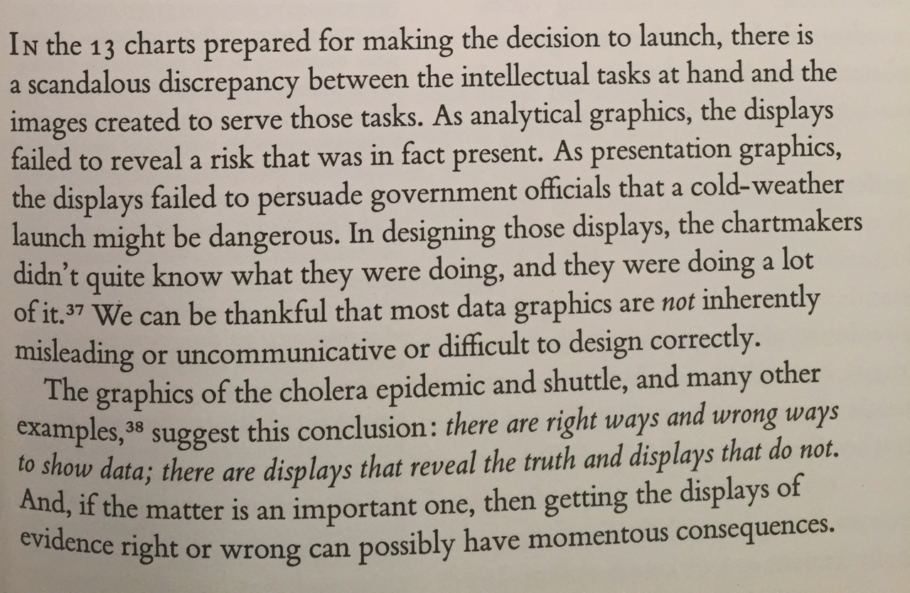

# Class 03 –  Feb 1  2016:

## House Keeping:
* Any announcements?
* Starting at 5:15, leaving at 8:45.

## 5:30 - 6:10 Review PS-03
* Review print
* Review digital

## 6:10 – 6:30 Question time (L & C rescheduled):

* What kinds of things are you doing in other classes?
* What do you wish you were learning?
* What do you the weekly problem sets?
* Problems? (address issues after break)

## 6:30 BREAK

## 6:40-7:20 Discussions
#### [Powers of 10](https://www.youtube.com/watch?v=0fKBhvDjuy0)
Is this data visualization?
#### [Up and Down the Ladder of Abstraction](http://worrydream.com/#!2/LadderOfAbstraction)
Is this data visualization?
#### Angry Tufte:

#### Google Cardboard
Could this be used for visualization? Examples of projects it might be suited for?

## 7:10 - 7:20 BREAK

## 7:30 – 8:00 D3, and our survey data:
* Access data in arrays, the notation `array[i]`
* Accessing data in objects, the notation `object.distance` or `object[distance]`
* From web JSON and web services, as per [survey.js](js/survey.js)

## 8:00 – 8:45:

## [Problem Set 03 (ps-03) "Survey Data"](./ps03.html)
